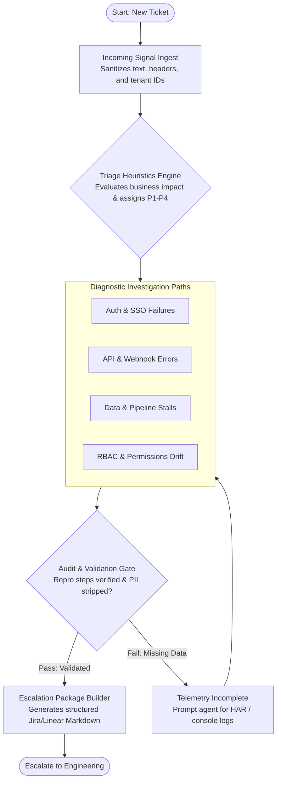

> **TriageFlow** is a structured, browser-based triage engine and decision-tree system built for SaaS customer support, solutions engineering, and incident response teams. It translates ambiguous incoming customer telemetry and ticket data into standardized severity matrices (P1–P4), reproducible diagnostic paths, and validated escalation packages.

---

## 🎯 Problem Statement

SaaS support and technical operations teams routinely encounter three critical operational failures:
1. **Queue Drift & Inconsistent Severity Tagging:** Priority assignments vary widely by agent sentiment or customer urgency phrasing rather than business impact and service impairment.
2. **Premature Engineering Escalation:** Up to 40% of technical escalations reach Tier 3 or Core Engineering without reproducible steps, client-side browser/network logs, or verified account configuration states.
3. **SLA Friction:** Lack of dynamic step-by-step diagnostic workflows inflates Mean Time to Acknowledge (MTTA) and Mean Time to Resolution (MTTR).

**TriageFlow** enforces structured intake, heuristic-based severity scoring, and guardrailed playbooks directly at the point of ingestion.

---

## 🚀 Access & Deployment

### Live Interactive Engine
* **Interactive Triage Tool:** [Launch TriageFlow](https://ryandus.github.io/TriageFlow-A-SaaS-Playbook/)
---

## ⚡ Key Capabilities

* **Dynamic Severity Scoring Matrix (P1–P4):** Evaluates issues against quantifiable impact criteria (data loss, tenant-wide degradation, security boundary breach, vs. isolated cosmetic bugs).
* **Deterministic Diagnostic Playbooks:** Step-by-step triage paths tailored to common SaaS failure domains:
  * Authentication & SSO/SAML assertion errors
  * Webhook and REST API payload/timeout failures
  * Role-Based Access Control (RBAC) & permissions drift
  * Ingestion, pipeline, and export job stalls
* **Escalation Gatekeeper:** Generates a structured escalation package (environment metadata, reproducible steps, payload logs, and preliminary triage findings) before a handoff ticket can be cut to engineering.
* **SLA Time Budget Tracker:** Visual indicators aligning diagnostic targets with enterprise customer support tiers.

---

## 🏗️ Architecture Overview

The system is designed with a lightweight, decoupled architecture to ensure deterministic state evaluation, rapid client-side execution, and clean data boundaries.

### Core Components

| Component | Functionality | Design Principle |
| :--- | :--- | :--- |
| **Ingestion Formatter** | Cleans customer narrative, isolates error strings, extracts HTTP status codes and tenant IDs. | Defensive sanitization; prevents raw, unstructured data propagation. |
| **Rule & Matrix Evaluator** | Applies deterministic logic to assign severity levels (P1: Critical/Down, P2: Major Degradation, P3: Impaired/Workaround Exists, P4: Minor/Query). | Objective, impact-driven priority assignment. |
| **Workflow State Machine** | Guides tier-1/tier-2 specialists through branch-logic troubleshooting based on previous check results. | Reproducibility; eliminates missed diagnostic steps. |
| **Handover Synthesizer** | Formats clean, structured markdown payloads ready for bug trackers (Jira, GitHub Issues, Linear) or ticketing platforms (Zendesk, Freshdesk). | Zero-overhead inter-team communication. |

---

## 🚦 Severity & SLA Framework

TriageFlow benchmarks issues against standard SaaS operational tiers:

| Severity | Qualification Criteria | Target Ack (MTTA) | Target Update |
| :--- | :--- | :--- | :--- |
| **P1** | Total service outage, data loss, critical security vulnerability | < 15 minutes | Every 30 min |
| **P2** | Core feature down; no workaround; broad user segment impacted | < 1 hour | Every 2 hours |
| **P3** | Non-critical feature failure; viable workaround exists | < 4 hours | Daily |
| **P4** | Cosmetic defect, minor UI anomaly, or general technical inquiry | < 12 hours | Weekly / Backlog |

---

## 🔒 Security & Data Hygiene

* **Zero-Retention Model:** Client-side processing ensures ticket data, API tokens, and customer metadata remain ephemeral in local runtime memory.
* **PII/Token Stripping Guidance:** Built-in validation checks advise agents to strip `Authorization: Bearer`, secret keys, and personal identifying information before staging logs into escalation tickets.

---

## 📄 License

Distributed under the MIT License. See `LICENSE` for more information.
